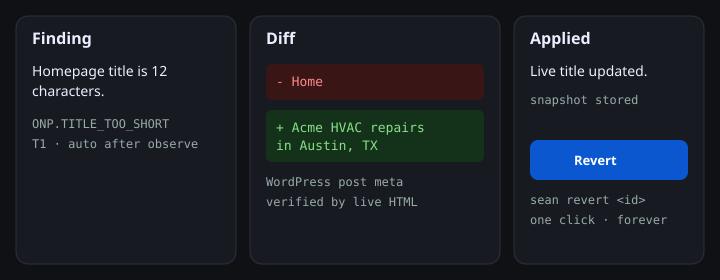

<p align="center">
  <strong>Agent Sean</strong><br/>
  The SEO engineer that never sleeps.
</p>

<p align="center">
  <em>Every SEO tool tells you what's wrong. Agent Sean fixes it.</em>
</p>

<p align="center">
  
</p>

<p align="center">
  <a href="docs/assets/demo/sean-demo.mp4">46-second demo</a> — finding, diff, Revert.
</p>

<p align="center">
  <a href="LICENSE">AGPL-3.0</a> ·
  <a href="docs/install.md">Docs</a> ·
  <a href="web/recipes/index.html">Recipes</a> ·
  <a href="TELEMETRY.md">Telemetry</a>
</p>

```bash
npx agentsean
```

An open-source, self-hosted, always-on autonomous SEO engineer. Installs from a
terminal, opens a local dashboard, connects to your data, and then actually does
the work — 24/7, on your real website, as a diff you can read and revert.

It binds **`127.0.0.1:7777` only**. `sean freeze` halts every write. Hosted never
stores CMS write credentials.

**Status:** Phase 11 (launch). A user runs one command, answers a handful of
questions, and walks away. See [`PLAN.md`](PLAN.md).

## Install

Requires **Node.js ≥ 22.19** if you already have Node. The curl installer
provisions Node if you do not. There is **no postinstall script** — npm v12
disables those by default, so Sean provisions on first *run*.

```bash
npx agentsean
# or
curl -fsSL https://raw.githubusercontent.com/vp2722/sean/main/install/install.sh | sh
# Windows
irm https://raw.githubusercontent.com/vp2722/sean/main/install/install.ps1 | iex
# Docker (loopback publish; token required)
SEAN_AUTH_TOKEN="$(openssl rand -base64 32)" docker compose up
```

```bash
sean doctor
sean service install    # opt-in; prints the files it will write
sean freeze
```

Every command accepts `--json`. Audit does not need the daemon or any
credentials. Connect Google opens the local dashboard at
`http://127.0.0.1:7777/connect` — a hosted page never talks to the daemon.

## What it does after you walk away

- crawls the site weekly and after every deploy
- pulls Search Console and Analytics daily
- finds issues against ~300 checks and prioritizes them by a [published formula](docs/priority.md)
- **fixes** the safe ones in WordPress / Shopify / Git / the edge
- queues the dangerous ones for one click
- rewrites decaying content within 2 refreshes/day and 2 new pages/day (not overridable)
- tracks ranks and AI citation share
- reports weekly, in your brand, with an [evidence tier](docs/measure.md) on every claim
- records every change with a before-snapshot and a revert button
- stops instantly when told to

## What it does not do

Stakeholder negotiation, strategy arguments, and deciding whether a business
should want the traffic. Tools that pretend otherwise are the ones people stop
trusting.

Sean never scrapes Google. Schema, word count, and `llms.txt` are not sold as
AEO levers. Training crawlers ≠ citation crawlers. Shopify theme writes are
refused. Unbounded city×service pages are refused.

## Prior art

[OpenSEO](https://github.com/every-app/open-seo) proved an open-source SEO
platform could work. Agent Sean is the execution layer that writes reversible
diffs to your actual site — **not a fork of OpenSEO**, and not a report that
stops at the finding. Selected OpenSEO modules are ported under MIT with
attribution; see [`THIRD_PARTY_NOTICES.md`](THIRD_PARTY_NOTICES.md).

## Supported CMS

| Surface | How Sean writes |
| --- | --- |
| [WordPress](web/recipes/fix-title-tags-wordpress.html) | Companion plugin + Application Passwords |
| [Shopify](web/recipes/fix-orphaned-pages-shopify.html) | Metafields. Theme writes refused. |
| [Next.js / Git](web/recipes/git-pr-title-tags-nextjs.html) | A PR you can read |
| Squarespace / Framer / Duda | Cloudflare edge overlay — never branches on user-agent |

## Docs

Install · [`docs/install.md`](docs/install.md) ·
Actions · [`docs/actions.md`](docs/actions.md) ·
Content · [`docs/content.md`](docs/content.md) ·
Keywords · [`docs/keywords.md`](docs/keywords.md) ·
Evidence · [`docs/measure.md`](docs/measure.md) ·
Adapters · [`docs/adapters.md`](docs/adapters.md) ·
Surfaces · [`docs/surfaces.md`](docs/surfaces.md) ·
Hosted · [`docs/hosted.md`](docs/hosted.md) ·
Launch · [`docs/launch.md`](docs/launch.md) ·
Site score · [`docs/site-score.md`](docs/site-score.md) ·
Security · [`docs/security.md`](docs/security.md)

Self-host is $0. Cloud Starter is $9/mo (BYOK). Agency is $249/mo for 25–50 sites.

<details>
<summary>Telemetry &amp; privacy</summary>

Off until you say yes at onboard (or `sean telemetry on`). Honor
`DO_NOT_TRACK=1`. Never domains, URLs, queries, keys, or IPs. Single call site:
`recordEvent`. Full list: [`TELEMETRY.md`](TELEMETRY.md).
</details>

## Repo

Canonical source for Agent Sean. Planned long-term home `github.com/seanhq/sean`;
until that org exists, development is at
[`github.com/vp2722/sean`](https://github.com/vp2722/sean).

```
packages/
  cli/           # npx agentsean
  launch/        # onboard, doctor, telemetry, recipes, service units
  daemon/        # Fastify, loopback bind, security middleware, SSE, SPA
  dashboard/     # React + Vite SPA (same origin, no CORS)
  …
  ee/            # commercial features (separate license)
```

## License

- Daemon, CLI, schema, and the rest of the AGPL tree: **AGPL-3.0-only**
- `packages/ee/`: **commercial license** (not OSI)
- WordPress companion plugin (`plugins/wordpress`): **GPL-2.0-or-later**
- Connector SDK (later): **Apache-2.0**

[`LICENSING.md`](LICENSING.md) · [`TRADEMARK.md`](TRADEMARK.md) ·
contributions require a [CLA](CLA.md). See [CONTRIBUTING.md](CONTRIBUTING.md).

## Security

The daemon is fail-closed. Host-header allowlisting, Origin / `Sec-Fetch-Site`
checks, a CSRF custom header on mutating requests, a random token (≥ 32
characters), and `SameSite=Strict` cookies are enforced before any feature code.
Remote access is Tailscale Serve or a Cloudflare Tunnel — never by opening the
port to the world. If you find a vulnerability, see [`SECURITY.md`](SECURITY.md).
