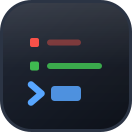
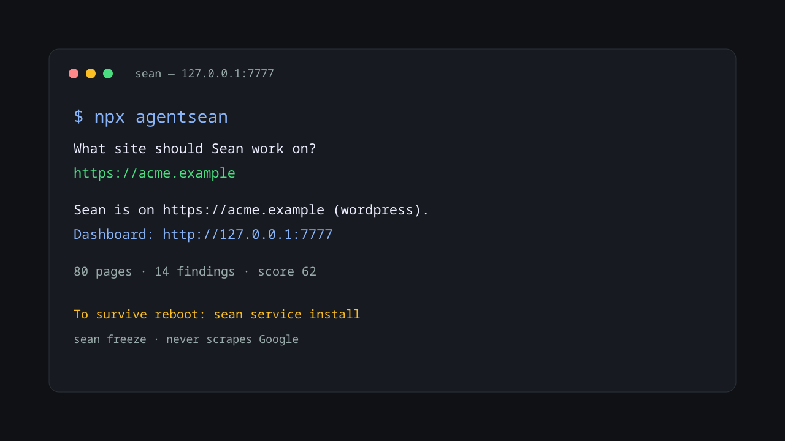
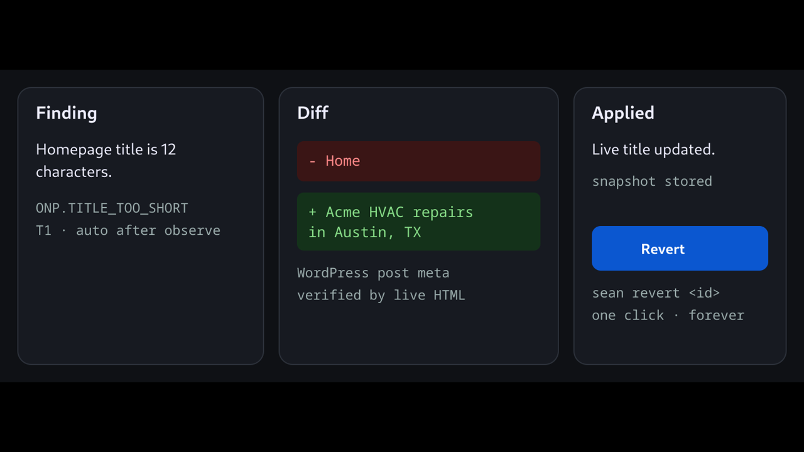

<p align="center">
  
</p>

<h1 align="center">Agent Sean</h1>

<p align="center">
  <strong>The SEO engineer that never sleeps.</strong><br/>
  Every SEO tool tells you what's wrong. Agent Sean fixes it.<br/>
  <sub>In WordPress, in Shopify, in your Git repo, at the edge — as a diff you can read and revert.</sub>
</p>

<p align="center">
  <a href="https://github.com/seziro-team/agentsean/actions/workflows/ci.yml"></a>
  <a href="https://www.npmjs.com/package/agentsean"></a>
  <a href="LICENSE"></a>
  <a href="https://nodejs.org"></a>
  <a href="https://github.com/seziro-team/agentsean/stargazers"></a>
  <a href="https://github.com/seziro-team/agentsean/discussions"></a>
  <a href="CONTRIBUTING.md"></a>
</p>

<p align="center">
  
</p>

<p align="center">
  <a href="#quickstart">Quickstart</a> ·
  <a href="docs/install.md">Docs</a> ·
  <a href="ARCHITECTURE.md">Architecture</a> ·
  <a href="#security">Security</a> ·
  <a href="#pricing">Pricing</a> ·
  <a href="https://github.com/seziro-team/agentsean/discussions">Discussions</a> ·
  <a href="docs/assets/demo/sean-demo.mp4">46s demo</a>
</p>

```bash
npx agentsean
```

---

Agent Sean is an **open-source, self-hosted, always-on autonomous SEO engineer**.
It installs from a terminal, opens a local dashboard, connects to your Search
Console and your CMS, and then does the work — 24/7, on your real website.

It does not generate a report and leave. It writes the fix into WordPress, into
Shopify, into a Git pull request, or at the edge — with a before-snapshot stored
and a Revert button next to every change.

<p align="center">
  
</p>

## What it does after you walk away

- Crawls your site weekly and after every deploy — polite, JS-capable, `robots.txt`-respecting
- Pulls Search Console, Analytics, PageSpeed, and CrUX daily
- Runs **425 checks** across 25 detector families and ranks findings by a [published formula](docs/priority.md)
- **Fixes** the safe ones automatically in WordPress / Shopify / Git / the edge
- Queues the dangerous ones for one click — and refuses the ones that are never safe
- Refreshes decaying content within a hard cap of 2 refreshes and 2 new pages per day
- Tracks ranks, brand mentions, and AI citation share
- Reports weekly with an [evidence tier](docs/measure.md) on every claim, and says "not measurable" when it isn't
- Records **every** change with a before-snapshot and a one-command revert
- Stops instantly, everywhere, on `sean freeze`

The dashboard can be closed. The daemon keeps working.

## What it does not do

Stakeholder negotiation, strategy arguments, and deciding whether a business
should want the traffic. Tools that pretend otherwise are the ones people stop
trusting.

Sean never scrapes Google. Schema, word count, and `llms.txt` are not sold as AEO
levers. Training crawlers are not conflated with citation crawlers. Shopify theme
writes are refused. Unbounded city × service page generation is refused.

## Quickstart

Requires **Node.js ≥ 22.19** if you already have Node. The curl installer
provisions Node if you don't. There is **no `postinstall` script** — npm v12
disables those by default, so Sean provisions on first *run*.

```bash
# npm
npx agentsean

# macOS / Linux
curl -fsSL https://raw.githubusercontent.com/seziro-team/agentsean/main/install/install.sh | sh

# Windows
irm https://raw.githubusercontent.com/seziro-team/agentsean/main/install/install.ps1 | iex

# Docker — loopback publish, token required
SEAN_AUTH_TOKEN="$(openssl rand -base64 32)" docker compose up

# Homebrew
brew install seziro-team/tap/agentsean
```

Then:

```bash
sean doctor            # environment preflight, every check explained
sean audit https://…   # full audit — no daemon, no credentials, no account
sean start             # daemon + dashboard on http://127.0.0.1:7777
sean service install   # survive reboot; prints every file it will write first
sean status            # what changed, when, and how to undo it
sean revert <id>       # undo one change
sean freeze            # halt every write, everywhere, immediately
```

Every command accepts `--json`. `sean audit` works with zero credentials and zero
account — that is the whole free tier, and it is genuinely useful on its own.

<details>
<summary><strong>All 23 commands</strong></summary>

`apply` · `audit` · `connect` · `content` · `doctor` · `freeze` · `keywords` ·
`local` · `mcp` · `measure` · `mentions` · `onboard` · `recipes` · `revert` ·
`service` · `signup` · `start` · `status` · `stop` · `telemetry` · `tenant` ·
`uninstall` · `update` · `visibility`

</details>

## Why this is different

| | Report-only tools | Proxy "auto-fix" tools | **Agent Sean** |
| --- | --- | --- | --- |
| Finds issues | Yes | Yes | Yes |
| Writes the fix | No | Yes, at a JS proxy | **Yes, into your source of truth** |
| Fix survives cancellation | — | **No** | **Yes** |
| Reviewable diff | — | No | **Yes** |
| One-click revert | — | — | **Yes, with a stored snapshot** |
| Runs unattended | No | Yes | **Yes** |
| Self-hostable | Sometimes | No | **Yes, entirely** |
| Your data leaves your machine | Yes | Yes | **No — local-first, BYOK** |

Serving crawlers a JavaScript-proxied page means the fixes evaporate when you
cancel, and the technique sits uncomfortably close to cloaking. Sean's Cloudflare
edge overlay is the one case where it works at the edge, and it is **asserted in
CI to never branch on user-agent**.

## How it works

```
CLI ──▶ DAEMON (one process · one port · 127.0.0.1 only)
         │
   Scheduler ─▶ Crawler ─▶ Analyzers ─▶ Findings + priority
                                              │
                                          PLANNER      deterministic first,
                                   emits typed Action[]   LLM for judgement only,
                                              │           never sees credentials
                                          VALIDATOR    15 deterministic checks:
                                              │        schema · target binding ·
                                              │        first-appearance · diff caps ·
                                              │        blast radius · tier · budget ·
                                              │        invisible chars · encoded payloads ·
                                              │        banned output · two-key · vertical ·
                                              │        observe window · rate limit
                                          EXECUTOR    snapshot ▸ apply ▸ verify ▸ record
                                              │
      WordPress · Shopify · Git PR · Cloudflare edge · Webflow · Ghost · Wix · BigCommerce
```

Full detail in [`ARCHITECTURE.md`](ARCHITECTURE.md).

### The autonomy model

Full-auto by default, with a short list that is **not overridable** — because the
constraint is external (Google's spam policies, the EU AI Act, US copyright law),
not our caution.

| Tier | Meaning | Default |
| --- | --- | --- |
| **T0** Observe | Read-only analysis | Always on |
| **T1** Auto | Applied immediately, logged, revertible | On |
| **T2** Auto with budget | Applied up to a rate cap, then queues | On |
| **T3** Gated | Always requires a human click. **Locked.** | Locked |
| **T4** Refused | No setting exists. | Locked |

T3 covers `robots.txt`, `noindex`, redirects, canonicals, page deletion, outreach
email, and disavow files. T4 covers link buying, PBNs, cloaking, hidden text,
writing to third-party domains, review gating, bundled SERP scraping, and content
generation for YMYL or affiliate sites.

**Every newly connected site gets a 7-day observe-only period.** Sean watches,
builds a baseline, and proposes — but writes nothing — for the first week. This
can be shortened to 24 hours. It cannot be set to zero.

## Security

A crawling agent's entire input diet is authored by parties with a financial
interest in you ranking worse. That is the threat model, and it is the reason for
the architecture.

**The three-plane model.** No plane both sees third-party bytes and holds credentials.

| Plane | Sees third-party bytes | Holds credentials | Output |
| --- | --- | --- | --- |
| Analysis | Yes | **No** | Closed-schema structs, zero free-string fields |
| Planning | **No** | **No** | Typed `Action[]` |
| Execution | **No** | Yes | Applied diffs |

**The keystone rule.** No `Action` field may contain a URL, domain, or entity
whose first appearance in the system was inside third-party content. Every URL in
an action must resolve to a row in our own crawl table. This one deterministic
rule defeats off-site canonical injection, attacker redirects, JSON-LD URL
injection, hreflang poisoning, and disavow attacks — without asking a model to be
clever about it.

**The daemon is fail-closed.** It binds `127.0.0.1:7777` only. Host-header
allowlisting, `Origin` and `Sec-Fetch-Site` checks, a CSRF custom header on
mutating requests, a ≥32-character random token compared in constant time, and
`SameSite=Strict` cookies are all enforced before any feature code runs. CORS
headers are actively stripped. Auth cannot be disabled. Binding off-loopback
without auth throws and refuses to start. `Host: evil.com` returns 403 — asserted
by three tests in CI.

**Credentials** live in the OS keychain via `@napi-rs/keyring`, falling back to an
XChaCha20-Poly1305 encrypted vault at mode `0600`. The LLM never holds a
credential and never calls a write API.

**A 30-payload red-team suite runs in CI** — hidden text, Unicode tag blocks, bidi
overrides, base64 and HTML-entity encoded payloads, `X-AI` header injection,
off-site canonicals, JSON-LD hijacks — and asserts that every single one is
blocked.

Remote access is Tailscale Serve or a Cloudflare Tunnel. Never by opening the
port. Report vulnerabilities via
[Security Advisories](https://github.com/seziro-team/agentsean/security/advisories/new)
— see [`SECURITY.md`](SECURITY.md).

## Where Sean can write

| Surface | How Sean writes | Rollback |
| --- | --- | --- |
| [WordPress](web/recipes/fix-title-tags-wordpress.html) | Companion plugin + Application Passwords. Understands Yoast, Rank Math, AIOSEO, SEOPress. | Revision restore |
| [Shopify](web/recipes/fix-orphaned-pages-shopify.html) | Admin GraphQL SEO fields + metafields. **Theme writes refused.** | Field restore |
| [Next.js / any Git repo](web/recipes/git-pr-title-tags-nextjs.html) | A branch, a commit, and a pull request you read before merging. | `git revert` |
| Squarespace · Framer · Duda | Cloudflare Worker overlay. **Never branches on user-agent.** | Overlay removal |
| Webflow · Ghost · Wix · BigCommerce | Native SEO APIs | Field restore |
| Contentful · Sanity · Strapi · Payload | Generic headless adapter | Field restore |

Missing yours?
[Request an adapter](https://github.com/seziro-team/agentsean/issues/new?template=03-adapter.yml)
— the interface is six methods.

## Bring your own everything

- **LLM** — Anthropic, OpenAI, Google, OpenRouter, or a local Ollama. BYOK, routed by task class, with cost estimated before the call.
- **Data** — the free stack (Search Console, Analytics, PageSpeed, CrUX, Bing, your own crawler) covers roughly 90% of capability with **zero paid API keys**. DataForSEO and others plug in behind a provider interface that quotes cost before spending.
- **Database** — SQLite (WAL) locally, Postgres for the hosted tier, one schema.

## Docs

| | | |
| --- | --- | --- |
| [Install](docs/install.md) | [Actions & tiers](docs/actions.md) | [Adapters](docs/adapters.md) |
| [Architecture](ARCHITECTURE.md) | [Content engine](docs/content.md) | [Surfaces](docs/surfaces.md) |
| [Security](docs/security.md) | [Keywords](docs/keywords.md) | [Google APIs](docs/google.md) |
| [Priority formula](docs/priority.md) | [Evidence & measurement](docs/measure.md) | [Site score](docs/site-score.md) |
| [Daemon](docs/daemon.md) | [Hosted tier](docs/hosted.md) | [Telemetry](TELEMETRY.md) |
| [Billing providers](docs/billing.md) | [Governance](GOVERNANCE.md) | [Changelog](CHANGELOG.md) |
| [Roadmap](ROADMAP.md) | [Contributing](CONTRIBUTING.md) | [Support](SUPPORT.md) |

The 66k-word engineering plan this was built from is in [`PLAN.md`](PLAN.md), and
the 3 MB of fact-checked research behind it is in [`research/`](research/). Both
are published deliberately.

## Pricing

| | Self-host | Cloud | Enterprise |
| --- | --- | --- | --- |
| **Price** | **$0 forever** | from **$9/mo** | Talk to us |
| Sites | Unlimited | 1 → 50 | Unlimited |
| All 425 checks | Yes | Yes | Yes |
| Autonomous fixes | Yes | Yes | Yes |
| Your data leaves your machine | Never | Encrypted, EU-hosted | Your choice, incl. air-gapped |
| Managed Google OAuth | — | Yes | Yes |
| Rank tracking | Weekly | Weekly → daily | Daily |
| White-label + client seats | Yes | Agency tier | Yes |
| SSO / SAML / SCIM | — | — | Yes |
| Audit log, SLA, DPA | — | DPA | Yes |
| Support | Community | Email | Named contact + SLA |

Self-hosting is not a crippled tier. It is the whole product, and it is free
forever. The Cloud tier exists because not everyone wants to run a daemon.

## Contributing

```bash
git clone https://github.com/seziro-team/agentsean.git
cd agentsean
pnpm install
pnpm ci        # lint + build + typecheck + test — 562 tests
```

Read [`CONTRIBUTING.md`](CONTRIBUTING.md) and [`ARCHITECTURE.md`](ARCHITECTURE.md)
first. Contributions require a [CLA](CLA.md) so the project can keep
dual-licensing. Governance is in [`GOVERNANCE.md`](GOVERNANCE.md) — the short
version is that the T3/T4 locked lists and the AGPL core will not be narrowed.

New platform adapters are the highest-leverage contribution.

## Prior art

[OpenSEO](https://github.com/every-app/open-seo) proved an open-source SEO
platform could work. Agent Sean is the execution layer that writes reversible
diffs to your actual site — **not a fork of OpenSEO**, and not a report that stops
at the finding. Selected OpenSEO modules are ported under MIT with attribution;
see [`THIRD_PARTY_NOTICES.md`](THIRD_PARTY_NOTICES.md).

## License

- Daemon, CLI, crawler, analyzers, adapters, schema — **AGPL-3.0-only**
- `packages/ee/` — **commercial license**, not OSI. Isolated so the AGPL claim over the core stays clean.
- `plugins/wordpress/` — **GPL-2.0-or-later**, for WordPress.org compatibility
- Connector SDK (planned) — **Apache-2.0**

AGPL-3.0 is a real OSI-approved license, not a source-available substitute. You
can self-host, modify, and redistribute. The network-use clause is what prevents
unlicensed commercial resale. For a commercial license without AGPL obligations,
open a [Discussion](https://github.com/seziro-team/agentsean/discussions).

[`LICENSING.md`](LICENSING.md) · [`TRADEMARK.md`](TRADEMARK.md) · [`CLA.md`](CLA.md)

<details>
<summary><strong>Telemetry &amp; privacy</strong></summary>

Off until you say yes at onboard, or run `sean telemetry on`. `DO_NOT_TRACK=1` is
honoured. Never domains, URLs, queries, keys, or IP addresses. A single call site,
`recordEvent`, so the claim is auditable in one grep. Full event list:
[`TELEMETRY.md`](TELEMETRY.md).

</details>

---

<p align="center">
  Built by <a href="https://seziro.com">Seziro</a>.<br/>
  <sub>Signal in. Form out.</sub>
</p>
